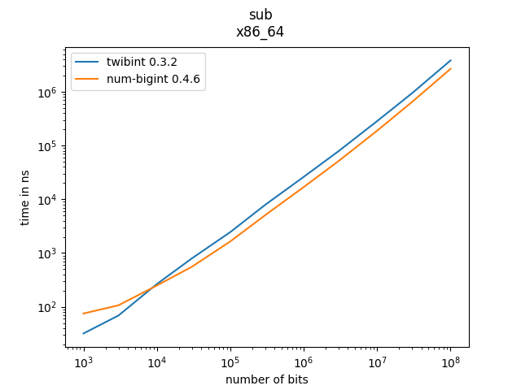
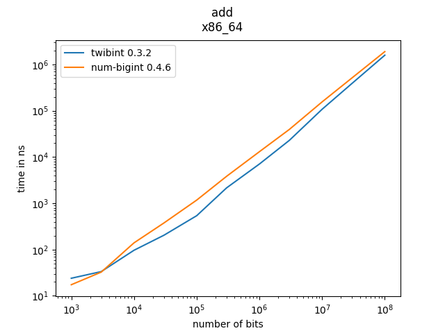
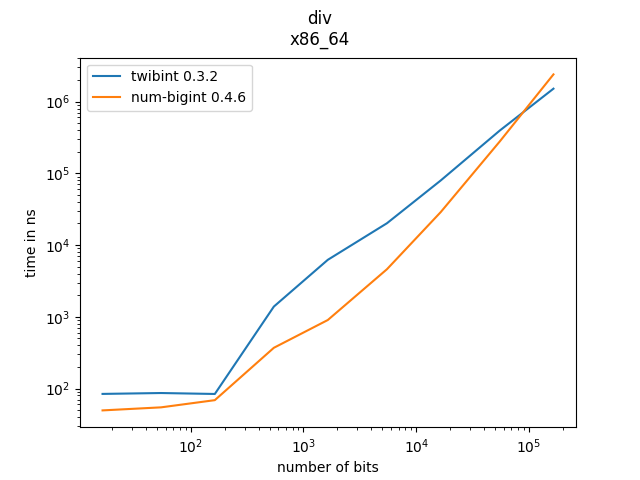

# Performance of `twibint`

## comparing to Python integers
A very simple and naive scripts helps evaluate how the performance compares to 
Python integers: `benches.py`.

Simply put, `twibint`'s multiplication, and division are much faster. 
Addition is slightly faster. I've not produced a systematic study 
comparing the 2 option at different scales at this point.

## comparing to `num-bigint`
Running the Python script `run_benchmarks.py` will run a series of benchmarks 
for several operations at different scales, and produce figures to compare
performance between `twibint` and `num-bigint`. In the future, I'd like these
benchmarks to include more crates.

For each operation (add, sub, mul, div), we generate a pair of random integer
that have at least a certain size (every bit is random except the most 
significant one, to ensure they always have the same size). We measure the 
non-assign version of the operation (we never use mul_assign or add_assign 
for example). Sometimes we also measure an "asymetric" version of a binary 
operation, where one operand is around 3 times bigger than the other.

